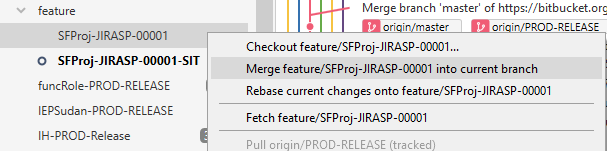

# Salesforce App

This guide helps IATA Salesforce Developers to understand the git flow and generate deployable packages.

On this guide you can find:

* [Part 1: Repository configuration](#markdown-header-part-1-repository-configuration)  
	
	* [Production Repository](#markdown-header-production-repository)
	
	* [Forked Repository](#markdown-header-forked-repository)
	  
	* [Pull Requests (package)](#markdown-header-pull-requests-package)
  
* [Part 2: Sandbox Configuration](#markdown-header-part-2-sandbox-configuration)

  

In case of questions, please contact the Release Manager: Rúben Nunes: nunesr@iata.org

## Part 1: Repository configuration

For every Salesforce Project, the Bitbucket repository will always be the source of truth and a fork is generated from the Production-Master repository.

The source code is in the metadata format, due to this format we recommend using [VSCode](https://code.visualstudio.com/) with [ForceCode](https://marketplace.visualstudio.com/items?itemName=JohnAaronNelson.ForceCode) Extension

The developer locally on its computer should have in the same folder of the cloned repository the salesforce project (forceCode). This is the only way to capture the changes to commit.

Before start developing please make sure you are aware of the development guide (DOs and DONTs document).

As a developer, you should always commit only the changes in the files modified by you and you should leave a clear commit message, including the Jira User Story you're working on.

#### Production Repository

Production Repository have always 4 branches:

**SIT** -  Represents the content of SIT, a developer sandbox environment, and is used to integrate the code, test the deployments, run apex test regressions and confirm code coverage percentage.

**PREPROD** - Represents the content of PREPROD, a full copy sandbox, is used for post deployments rehearsals, end to end testing, and UATs.

**PROD-RELEASE** - Is the staging branch to Production. When a package is ready to be deployed to production a Pull Request is created to this branch and will be merged with the master once the deployment is completed.

**master** -  Represents the current content of Production environment

#### Forked Repository

The forked repository should always have its master branch synced with the Production-Master repository. It is the responsibility of the Dev team to synchronize it using the Sync button in the Source tab in Bitbucket.

A forked repository should contain:

feature/ branches -  Should contain the developments related to a specific Jira User Story
release/ branches - All the feature branches merged to create a branch with all the content for a specific release (creation of the release package)

#### Pull Requests (package)

To send the new developments to the Production, 3 identical Pull Requests must be created, containing the same content, to the correspondent branches following the bellow naming convention:

ProjNameorDevName-SprintNRorTicketNR-Environment 

The branches should be created locally using the feature/release branch as base and merging them into the one it should be sent. Then the PR should be created to the correspondent branch.

SFProj-JIRASP-00001-SIT

SFProj-JIRASP-00001-PREPROD

SFProj-JIRASP-00001-PRODRELEASE

To create the right branch follow these 3 simple steps (the example below was done using [Source Tree](https://sourcetreeapp.com/?utm_source=bitbucket&utm_medium=tutorial_repo_link&utm_campaign=sourcetree-text) git client, you can use any tool that fits you):

*1- Checkout the end point branch:*

*2 - Merge the feature/release branch into the checkout branch*:

*3 - Push the branch to the Bitbucket repository and create the Pull Request to the correspondent branch*

<u>Before creating the Pull Request, the developer should make sure he is aware of all the included changes, the classes have at least 85% coverage and they will not cause any deployment failure.</u>

The description of the PR, should contain:

- A brief description of the content
- All Jira User Stories related
- A list of all the test classes which cover the changes (which cover all the new changes and keep the class with 85%)

**If changes in the bellow processes are included in the Pull Request please make sure its owners approved them in advance:**

| Process                     | Owner                   |
| --------------------------- | ----------------------- |
| AMS (any AMS related class) | CFDS                    |
| Account - sector/category   | Account Management Team |

## Part 2: Sandbox Configuration

Community Configuration:

CS Portal: 

| Steps                                            | Value (use the SB current domain)                            |
| ------------------------------------------------ | ------------------------------------------------------------ |
| **Custom Label**                                 |                                                              |
| CSP_PortalPath                                   | /csportal/s/                                                 |
| CSP_PortalBaseURL                                | https://**preprod**-customer-portal-iata.**cs129**.force.com |
| **Custom Setting**                               |                                                              |
| ISSP CS → Host                                   | **preprod**-customer-portal-iata.**cs129**.force.com         |
| ISSP CS → HostCSP                                | **preprod**-customer-portal-iata.**cs129**.force.com/csportal/s/ |
| Export CSPortal assets from PP                   | CSP community ->workspace -> Administration -> Pages -> Go to [Site.com](http://site.com/) -> Export Assets |
| Go to Community in the refreshed sandbox Import  | CSP community -> workspace -> Administration -> Pages -> Go to [Site.com](http://site.com/) Studio -> Import Assets |
| Pencil Button in the Builder and edit Global CSS | -Replace the import line @import url("https://**preprod**-customer-portal-iata.cs**129**.force.com/csportal/s/sfsites/c/resource/CSP_Stylesheet");- Find all the URL's importing lines and replace the beginning (/s/) with new path /csportal/s/ |
| Publish the community                            |                                                              |

Identity:

| Steps                                           | Value                                                        |
| :---------------------------------------------- | :----------------------------------------------------------- |
| Custom Setting: ISSP CS                         | Identity Login Page = https://support-customer-portal-iata.cs83.force.com/identity/s/login (use the SB current domain) IdentityPortal = [support-customer-portal-iata.cs83.force.com/identity/s](http://support-customer-portal-iata.cs83.force.com/identity/s) (use the SB current domain) |
| Export Identity assets from PP                  | Identity community ->workspace -> Administration -> Pages -> Go to [Site.com](http://site.com/) -> Export Assets |
| Go to Community in the refreshed sandbox Import | Identity community -> workspace -> Administration -> Pages -> Go to [Site.com](http://site.com/) Studio -> Import Assets |
| Edit Head Markup                                | Identity community -> workspace -> Builder -> Settings -> Advanced -> Edit Head Markup -> Find all the URL's importing lines and replace the beginning (/s/) with new path /identity/s/ |
| Publish the community                           |                                                              |

Ecommerce:

| Steps                    | Value                                       |
| ------------------------ | ------------------------------------------- |
| Create Records in obj    | Ecommerce_Site_Link__c                      |
| Populate Custom Settings | **IEC_SETTINGS__c**, IEC_SAP_SETTINGS__c    |
| Ecommerce Workspace      | Login and registration page type: IEC_Login |

